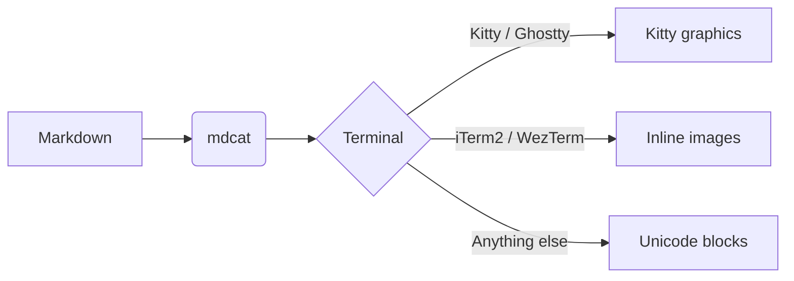

## How it works

```mermaid
flowchart LR
    A[Markdown] --> B(mdcat)
    B --> C{Terminal}
    C -->|Kitty / Ghostty| D[Kitty graphics]
    C -->|iTerm2 / WezTerm| E[Inline images]
    C -->|Anything else| F[Unicode blocks]
```

Diagrams are drawn with **mermaid-cli** and shown inline as real images —
no ASCII art. Without `mmdc` installed, the source is shown as a code block.
