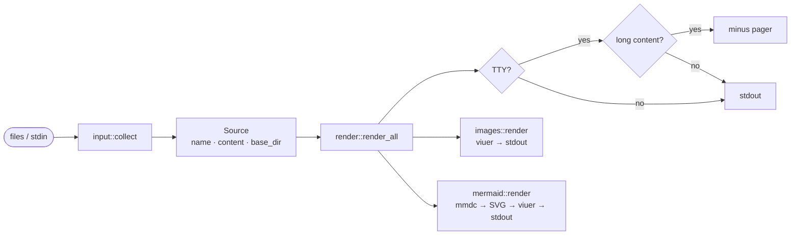

# Heading 1

## Heading 2

### Heading 3

This paragraph has **bold text**, *italic text*, and `inline code`.
It also has ~~strikethrough~~ and a [link](https://example.com).

> This is a blockquote.
> It can span multiple lines.

---

## Code Block

```rust
fn main() {
    println!("Hello, world!");
    let x: Vec<u32> = (1..=5).collect();
    println!("{x:?}");
}
```

```python
def greet(name: str) -> str:
    return f"Hello, {name}!"

print(greet("mdcat"))
```

## Table

| Language | Paradigm    | Typed  |
|----------|-------------|--------|
| Rust     | Systems     | Static |
| Python   | Scripting   | Dynamic|
| Haskell  | Functional  | Static |

## Mermaid Diagram



## Task List

- [x] Markdown rendering
- [x] Syntax highlighting
- [ ] Image rendering
- [x] Mermaid diagrams

## List

1. First item
2. Second item
   - Nested bullet
   - Another nested
3. Third item
